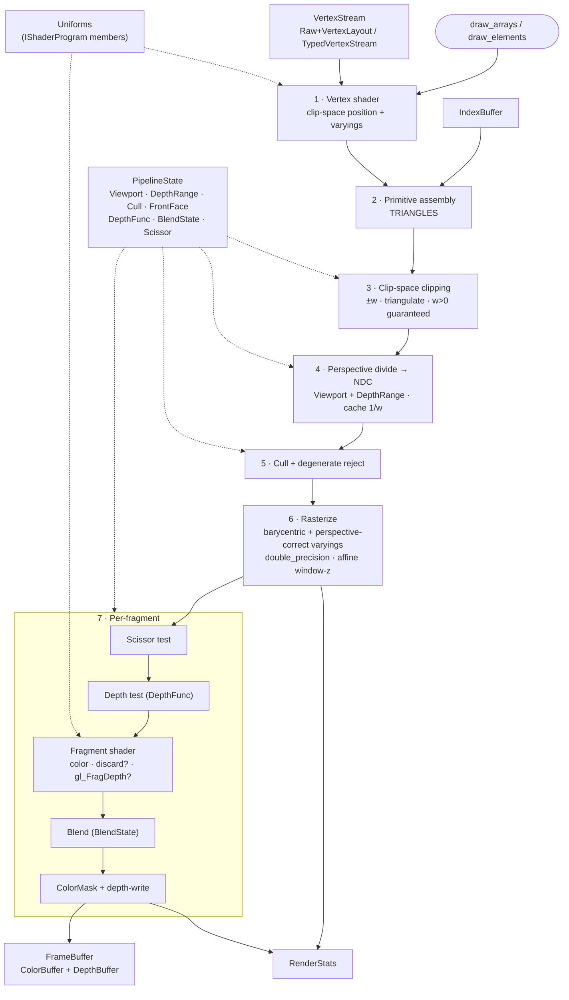
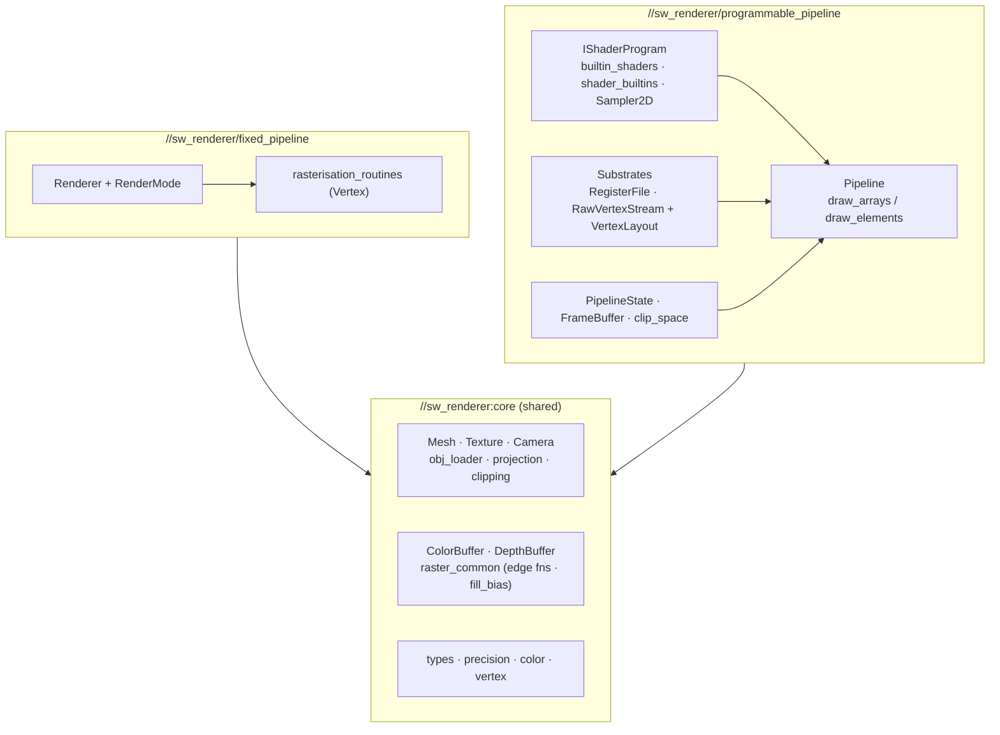

# sw_renderer

Software triangle renderer with configurable precision (IEEE 754 float or fixed-point via `RTW_USE_FIXED_POINT`).

The renderer ships **two coexisting pipelines** layered over a shared core:

- **`fixed_pipeline`** — the legacy fixed-function `Renderer` (render-mode flags: wireframe,
  shading, texturing, lighting, face culling, normals). Stable, kept as the reference path.
- **`programmable_pipeline`** — an OpenGL-style programmable `Pipeline` driven by a virtual
  `IShaderProgram` (vertex + fragment stages, varyings, samplers, full blend/scissor/depth state).

Tutorial guides for each pipeline:

- [`fixed_pipeline/README.md`](./fixed_pipeline/README.md) — how the fixed-function renderer was built
  from mesh traversal into a full software triangle pipeline.
- [`programmable_pipeline/README.md`](./programmable_pipeline/README.md) — how the programmable path was
  assembled from shader interfaces, vertex streams, clip space, rasterization, and render state.

## Package layout

### `//sw_renderer:core` — shared foundation

| Header | Description |
|--------|-------------|
| `precision.h` | Scalar type aliases (`single_precision`, `double_precision`, `ULP`) |
| `types.h` | Vector / point / matrix / angle / barycentric aliases; `MAX_VARYING_COUNT` |
| `color.h` | Packed RGBA color (4 bytes) with saturating arithmetic; `Vector4` interop |
| `vertex.h` | Vertex struct (position, tex coord, normal, color) |
| `tex_coord.h` | Texture coordinate (u, v) wrapper |
| `texture.h` | Texture image (pixel data + dimensions) |
| `mesh.h` | Mesh struct (vertices, faces, materials, textures) |
| `obj_loader.h` / `obj_loader.cpp` | Wavefront `.obj` / `.mtl` parsing |
| `projection.h` | Screen-space and NDC transformation matrices |
| `camera.h` | Camera (view matrix, movement) |
| `clipping.h` | Generic Sutherland-Hodgman polygon clipper (ADL `signed_distance` / `lerp` seams) |
| `raster_common.h` | Shared rasterizer primitives (`draw_line_*`, `is_top_left`, `fill_bias`, edge functions) |
| `color_buffer.h` / `depth_buffer.h` | Framebuffer attachments (pixel data / Z-buffer) |
| `render_stats.h` | Per-frame `RenderStats` counters |
| `ostream.h` | Stream formatting for `Color` / `TexCoord` |

### `//sw_renderer:format` — fmt / `std::format` integration

| Header | Description |
|--------|-------------|
| `format.h` | `{fmt}` / `std::format` formatters for renderer types |

### `//sw_renderer/fixed_pipeline` — legacy fixed-function pipeline

| File | Description |
|------|-------------|
| `renderer.h` / `renderer.cpp` | `Renderer` class: render-mode flags, mesh drawing pipeline, stats |
| `rasterisation_routines.h` | Fixed-function rasterization (`Vertex`-based fill / interpolation / depth test) |

### `//sw_renderer/programmable_pipeline` — programmable pipeline

| Header | Description |
|--------|-------------|
| `pipeline.h` / `pipeline.cpp` | `Pipeline`: `draw_arrays` / `draw_elements` stage driver |
| `pipeline_state.h` | `PipelineState` (viewport, depth-range, cull, front-face, depth func, blend, scissor, color mask) |
| `pipeline_rasterisation.h` | Rasterizer overloads carrying generic varyings (register file) |
| `clip_space.h` | Clip-space `ClipVertex` + 6 homogeneous clip planes |
| `frame_buffer.h` | `FrameBuffer` wrapping `ColorBuffer` + `DepthBuffer` |
| `shader.h` | `IShaderProgram`, `VertexContext` / `FragmentContext`, `VertexShaderOutput` / `FragmentShaderOutput` |
| `shader_builtins.h` | GLSL-style helpers (`mix`, `saturate`, `step`, `smoothstep`, `fract`, `reflect`, `refract`, `texture`) |
| `builtin_shaders.h` | Ready-made shaders (`FlatColor`, `VertexColor`, `Textured`, `Lit`) + `attribute_location` |
| `sampler.h` | `Sampler2D` over `Texture` (wrap / filter modes) |
| `register_file.h` | `RegisterFile<T, N>` varying substrate (lerp-able) |
| `varyings.h` | `VaryingsBase` typed overlay helper over the register file |
| `vertex_layout.h` | `VertexLayout` / `VertexAttribute` / `ComponentType` descriptors |
| `vertex_stream.h` | `RawVertexStream` / `TypedVertexStream` / `AttributeView` / `IndexBuffer` |

## Architecture

### Fixed-function pipeline (`Renderer`)

```
OBJ/MTL file
    |
    v
 load_obj() --> Mesh (vertices, faces, materials, textures)
    |
    v
 Renderer::draw_mesh()
    |-- transform_face_vertices()    (model -> world space)
    |-- setup_normals()              (per-vertex or face normal)
    |-- calculate_light_intensity()  (dot product with light dir)
    |-- Face culling                 (back-face removal)
    |-- clip()                       (Sutherland-Hodgman against frustum)
    |-- triangulate()                (polygon -> triangle fan)
    |-- project_to_screen()          (clip -> NDC -> screen space)
    |-- fill_triangle_bbox()         (rasterize with depth test)
    v
 ColorBuffer + DepthBuffer --> pixel data
```

### Programmable pipeline (`Pipeline::draw_*`)

Solid edges are the data path; dotted edges are state / uniform inputs.



### Component layering

Both pipelines are independent stacks over the shared core. The programmable side keeps a
**dynamic substrate** (register file, raw vertex stream) plus **zero-cost typed overlays**, so a
future scripted backend (`IShaderProgram` subclass) can share the same rasterizer.



## Writing a shader

A shader is a subclass of `IShaderProgram` implementing the `vertex` and `fragment` stages.
Uniforms are plain members exposed via setters (Option A); the base class already carries the
MVP matrix (`set_mvp_matrix` / `get_mvp_matrix`). Vertex attributes are read by location through
the `attribute_location` contract (`POSITION`, `NORMAL`, `UV`, `COLOR`); inter-stage data is
written into the varying register file and arrives at the fragment stage perspective-correct.

```cpp
#include "sw_renderer/programmable_pipeline/builtin_shaders.h"  // attribute_location
#include "sw_renderer/programmable_pipeline/shader.h"
#include "sw_renderer/programmable_pipeline/shader_builtins.h"   // texture, mix, saturate, ...

namespace rtw::sw_renderer
{

class TintShader : public IShaderProgram
{
public:
  static constexpr std::uint32_t COLOR_VARYING{0U};

  void set_tint(const Vector4F& tint) noexcept { tint_ = tint; }

  // Vertex stage: emit clip-space position + varyings.
  VertexShaderOutput vertex(const AttributeView& in, const VertexContext& /*ctx*/) const override
  {
    VertexShaderOutput out;
    out.position = get_mvp_matrix() * in.attribute(attribute_location::POSITION);
    out.varyings[COLOR_VARYING] = in.attribute(attribute_location::COLOR);
    return out;
  }

  // Fragment stage: varyings are already interpolated.
  FragmentShaderOutput fragment(const DynamicVaryings& v, const FragmentContext& /*ctx*/) const override
  {
    FragmentShaderOutput out;
    out.color = math::hadamard(v[COLOR_VARYING], tint_);  // set out.discard / out.depth to override
    return out;
  }

private:
  Vector4F tint_{1.0F, 1.0F, 1.0F, 1.0F};
};

} // namespace rtw::sw_renderer
```

Drive it through a `Pipeline`:

```cpp
const VertexLayout layout{
    {VertexAttribute{attribute_location::POSITION, 0U, ComponentType::FLOAT32, 4U},
     VertexAttribute{attribute_location::COLOR, offsetof(MyVertex, color), ComponentType::FLOAT32, 4U}}};
const RawVertexStream stream{layout, stl::as_bytes(stl::make_span(vertices))};

FrameBuffer framebuffer{width, height};
PipelineState state;   // viewport, depth-range, cull, blend, scissor, depth func, ...
RenderStats stats;

TintShader shader;
shader.set_mvp_matrix(mvp);
shader.set_tint({1.0F, 0.5F, 0.5F, 1.0F});

Pipeline pipeline;
pipeline.draw_arrays(shader, stream, state, framebuffer, stats);
```

Available helpers and built-ins:

- **`shader_builtins.h`** — `mix`, `saturate`, `step`, `smoothstep`, `fract`, `reflect`, `refract`,
  and `texture(sampler, uv)`; `Sampler2D` exposes `WrapMode` / `FilterMode` (NEAREST / LINEAR).
- **`gl_*` built-ins** — `gl_FragCoord` (`FragmentContext::frag_coord`, pixel-centre `x+0.5`),
  `gl_FrontFacing` (`FragmentContext::front_facing`), `gl_FragDepth` (`FragmentShaderOutput::depth`),
  `gl_VertexID` (`VertexContext::vertex_id`).
- **`builtin_shaders.h`** — `FlatColorShader`, `VertexColorShader`, `TexturedShader`, `LitShader`
  are worked examples to copy from.

> `dFdx` / `dFdy`, `textureLod`, mip-LOD selection, instancing (`gl_InstanceID`) and `gl_PointSize`
> are not yet implemented — see the roadmap below.

## Render state

`PipelineState` is a plain aggregate resolving the OpenGL fixed-function state:

- `viewport` (`Viewport`) and `depth_range` (`DepthRange` — `z_near` / `z_far`)
- `cull_mode` (`CullMode`, default `NONE`) and `front_face` (`FrontFace`, default `COUNTER_CLOCKWISE`)
- `depth_func` (`DepthFunc`, default `LESS`), `depth_test_enabled`, `depth_write_enabled`,
  `depth_clear_value`
- `blend` (`BlendState` — separate RGB / alpha factors + equations, constant color, full
  OpenGL `BlendFactor` / `BlendEquation` table)
- `scissor` (`Scissor`) and `color_mask` (`ColorMask`)

`FrameBuffer` owns a `ColorBuffer` + `DepthBuffer` (constructed from width / height; room reserved
for a stencil attachment). `RenderStats` tracks per-frame `triangles_submitted` /
`triangles_clipped` / `triangles_culled` / `triangles_rendered`.

## Build & Test

```bash
bazel test //sw_renderer/...                    # core_tests + both pipelines (float + fixed-point)
bazel build //sandbox/sw_renderer:sw_renderer   # interactive demo (float)
bazel build //sandbox/sw_renderer:fp            # interactive demo (fixed-point)
```

The five test targets mirror the source folders: `//sw_renderer/tests:core_tests`,
`//sw_renderer/fixed_pipeline/tests:{fixed_pipeline_tests, fixed_pipeline_fixed_point_tests}`,
`//sw_renderer/programmable_pipeline/tests:{programmable_pipeline_tests, programmable_pipeline_fixed_point_tests}`.
The `*_fixed_point_tests` targets recompile their dependency graph with `-DRTW_USE_FIXED_POINT`.

## Design notes

- **Precision strategy** — the rasterizer widens edge functions, signed area, barycentric setup
  and the perspective combine to `double_precision`, then narrows per-fragment to `single_precision`
  at fragment hand-off. `frag_coord.xy` is the pixel centre `(px + 0.5, py + 0.5)`.
- **Top-left fill rule** — coverage uses a `fill_bias` whose sign follows the signed triangle area,
  so shared edges rasterize exactly once.
- **Clipping guarantees `w > 0`** for every emitted vertex, so the perspective divide is always
  safe; degenerate / zero-area triangles are culled, not asserted.
- **Color** uses saturating addition (`operator+`) and clamped `operator*`; the float-to-byte
  constructor clamps inputs to `[0.0, 1.0]`.
- **Texture sampling** clamps to `[0, width-1]` / `[0, height-1]` to prevent one-past-end access.
- **Fixed-point compatibility** — template code uses `T{0}` literals (not `0.0F`); the typed vertex
  path never inspects component types, so it works in any scalar mode.

## Roadmap

**Phase 1.5** — POINTS primitive + `gl_PointSize`; instancing + `gl_InstanceID`; quad-based
rasterization for `dFdx` / `dFdy` + mip LOD.

**Deferred** — stencil test/op (`StencilState` / `StencilBuffer`); sRGB decode-on-sample /
encode-on-write; tiled / multithreaded rasterization; a Phase 2 scripted backend
(`LuaShaderProgram : IShaderProgram` or a GLSL-like language).
