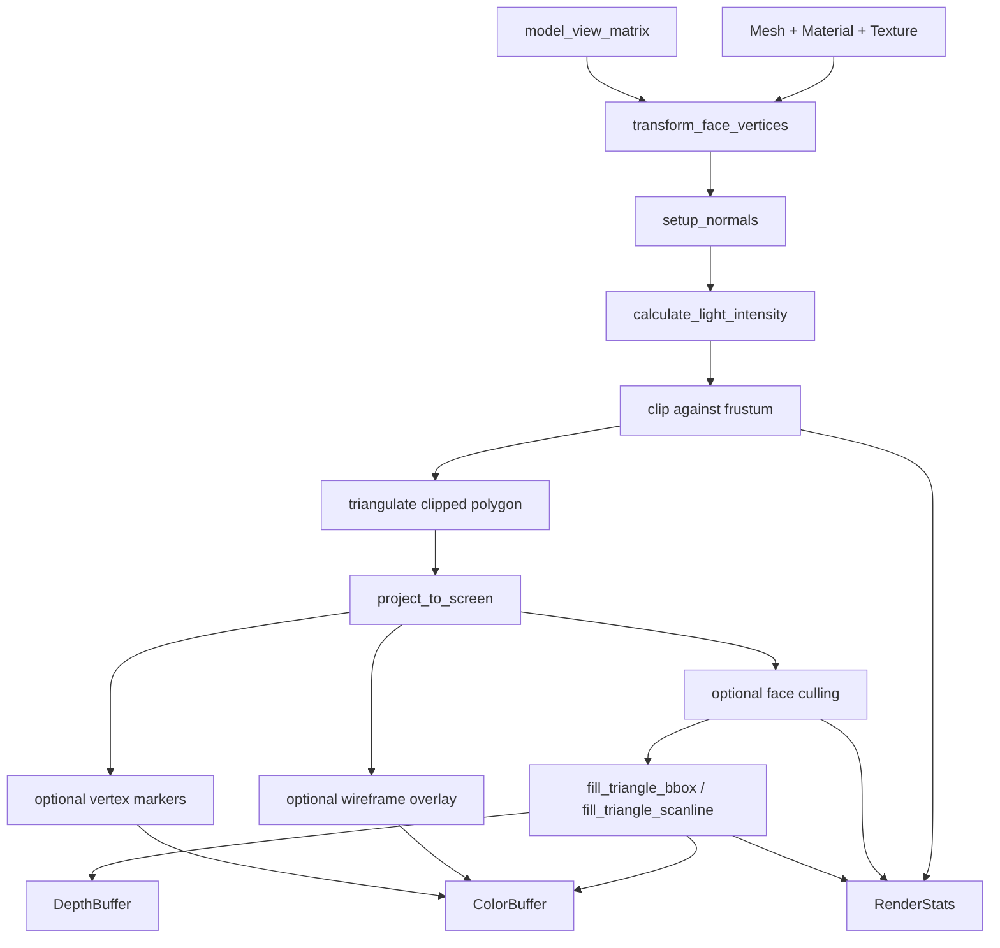

# fixed_pipeline

`//sw_renderer/fixed_pipeline` is the legacy fixed-function renderer. It keeps the entire frame
loop in one high-level class, `Renderer`, and is the easiest place to understand how this project
 originally grew from "draw a mesh" into a full software rasterizer.

This document explains the pipeline in tutorial form: what problems it solves, in what order the
stages were added, and which files implement each step.

## What this pipeline is

The fixed pipeline is built around one public entry point:

- `Renderer::draw_mesh(const Mesh&, const Matrix4x4F&)`

It takes a loaded `Mesh`, applies one transform matrix, and produces pixels in an internal
`ColorBuffer` plus visibility in an internal `DepthBuffer`.

Unlike the programmable pipeline, this path does not expose a shader interface. Instead, behavior is
selected through `RenderModeFlags`:

- face culling
- wireframe
- flat / Gouraud-style shading
- texture mapping
- directional lighting
- vertex drawing
- stats gathering

The public API lives in:

- `renderer.h`
- `renderer.cpp`
- `rasterisation_routines.h`

## Mental model

The easiest way to read this pipeline is to think of it as three layers:

1. Scene and asset layer
2. Triangle preparation layer
3. Raster and visibility layer



### 1. Scene and asset layer

These come from `//sw_renderer:core`:

- `Mesh` in `sw_renderer/mesh.h`
- `Texture` in `sw_renderer/texture.h`
- `ColorBuffer` / `DepthBuffer`
- generic clipping in `sw_renderer/clipping.h`
- projection helpers in `sw_renderer/projection.h`

By the time `Renderer::draw_mesh()` starts, the mesh has already been loaded by
`obj_loader.cpp` and contains:

- positions
- normals
- texture coordinates
- materials
- textures

### 2. Triangle preparation layer

Inside `Renderer::draw_mesh()`, each face goes through a sequence that matches a traditional fixed
graphics pipeline:

1. Read the face and its material.
2. Convert face indices into three working vertices with `transform_face_vertices()`.
3. Build normals with `setup_normals()`.
4. Compute a single light intensity with `calculate_light_intensity()` when lighting is enabled.
5. Clip the triangle against the view frustum with `clip()`.
6. Triangulate the clipped polygon with `triangulate()`.
7. Project each resulting triangle to screen space with `project_to_screen()`.
8. Optionally cull back-facing triangles.

That is the "triangle setup" phase of this renderer.

## How it was built, step by step

The current code reads like a pipeline assembled in practical stages.

### Step 1: draw pixels and lines

Before triangle filling, the renderer needs the ability to write individual pixels and edges.

The basic primitives are:

- `draw_pixel()`
- `draw_line()`
- `draw_triangle()`

`draw_line()` delegates to `draw_line_bresenham()` from `sw_renderer/raster_common.h`. That file is
part of shared core because both renderer stacks need the same raster rules.

This is the first useful milestone: once pixels and lines exist, wireframe rendering becomes
possible.

### Step 2: introduce the framebuffer and depth buffer

The renderer owns:

- `ColorBuffer color_buffer_`
- `DepthBuffer depth_buffer_`

That gave the pipeline two key properties:

- persistent image output for the whole frame
- hidden-surface removal through a Z test

Every filled triangle path compares an interpolated depth value against `depth(x, y)` and only
writes the pixel if it passes.

### Step 3: move from object-space triangles to camera-visible triangles

Meshes are not drawn directly in model space. `draw_mesh()` first transforms face vertices by the
incoming `model_view_matrix`, then clips them against the frustum.

This was an important design decision: clipping happens before screen projection. That keeps the
later rasterizer simpler and avoids exploding coordinates for triangles partially behind the camera.

Implementation points:

- `transform_face_vertices()`
- `clip()` from `sw_renderer/clipping.h`
- `triangulate()` from `sw_renderer/clipping.h`

### Step 4: project to screen and cache reciprocal `w`

`project_to_screen()` is where the pipeline becomes a rasterizer instead of just a mesh walker.

It performs:

1. projection multiply
2. perspective divide
3. NDC to screen transform
4. caching of `1 / w`
5. pre-dividing texture coordinates by `w`

Those last two details matter because the fill routines perform perspective-correct interpolation.
The function stores enough per-vertex information so the inner pixel loop does not need to redo the
expensive setup work.

### Step 5: add triangle filling

The actual rasterization lives in `rasterisation_routines.h`.

There are two families of triangle fill here:

- `fill_triangle_bbox()`
- `fill_triangle_scanline()`

The bounding-box path is the one the main renderer uses. It is based on edge functions and
barycentric coordinates, which is the more scalable implementation for a modern rasterizer.

The scanline path remains useful as an alternate implementation and for tests.

### Step 6: make interpolation perspective-correct

Once flat-color triangles worked, the next real problem was that colors and UVs should not be
interpolated linearly in screen space. The renderer solves this by using reciprocal depth / reciprocal
`w` during interpolation.

You can see this in the `fill_triangle_bbox()` overloads inside `renderer.cpp`:

- constant color path: only depth is interpolated
- vertex-color path: color is interpolated using the barycentric weights and corrected by `inv_z`
- textured path: UVs are interpolated the same way

That is the point where the renderer becomes visually correct for textured perspective scenes.

### Step 7: layer in fixed-function features

After the core triangle pipeline existed, higher-level renderer behavior was added as toggles:

- wireframe overlay
- textured fill
- shading
- face culling
- vertex debug drawing
- stats collection

The result is a very approachable renderer API: one class, one mesh draw call, and a small set of
render modes.

## The actual draw sequence

This is the real shape of `Renderer::draw_mesh()` today:

```text
for each face in mesh
  read material
  build v0/v1/v2 from face indices
  build normals
  compute light intensity
  clip triangle against frustum
  triangulate clipped polygon

  for each resulting triangle
    project vertices to screen space
    optional back-face cull
    optional shaded fill
    optional textured fill
    optional wireframe overlay
    optional vertex markers
```

That sequence is useful because it shows the renderer's philosophy: do coarse rejection and setup
first, then keep the per-pixel work narrow and predictable.

## Why `rasterisation_routines.h` is separate

The fixed pipeline keeps rasterization in a separate header because the rasterizer is a reusable,
policy-like layer under `Renderer`.

`Renderer` decides:

- which triangles to draw
- what per-pixel payload means
- whether to fill with color or texture

`rasterisation_routines.h` decides:

- which pixels are covered
- what barycentric weights each covered pixel gets
- how top-left edge rules are enforced

That split is why the package cleanly survived the repository refactor into `core`,
`fixed_pipeline`, and `programmable_pipeline`.

## Precision notes

This renderer supports both float and fixed-point builds. The important implementation detail is that
the rasterizer widens its edge-function math to `double_precision`.

Why that matters:

- `single_precision` can be `FixedPoint16`
- triangle area / barycentric edge functions can overflow in that precision
- widening those computations keeps large triangles stable

This is why the fixed-point tests focus heavily on:

- large-triangle coverage
- barycentric validity
- shared-edge single-cover behavior

See:

- `fixed_pipeline/tests/rasterisation_fixed_point_test.cpp`

## If you want to learn this pipeline from code

A good reading order is:

1. `renderer.h`
2. `renderer.cpp` starting at `draw_mesh()`
3. `rasterisation_routines.h`
4. `sw_renderer/clipping.h`
5. `sw_renderer/projection.h`
6. `sw_renderer/mesh.h`

That order mirrors how the renderer is actually structured: high-level orchestration first, then the
math-heavy inner loops.

## When to use this pipeline

Use the fixed pipeline when you want:

- the simplest end-to-end renderer path in the repo
- a reference implementation for visibility, clipping, and mesh drawing
- a compact software renderer with fixed-function behavior
- a baseline for comparing the programmable pipeline

Use the programmable pipeline when you want custom shading logic, explicit pipeline state, or an API
closer to OpenGL.
