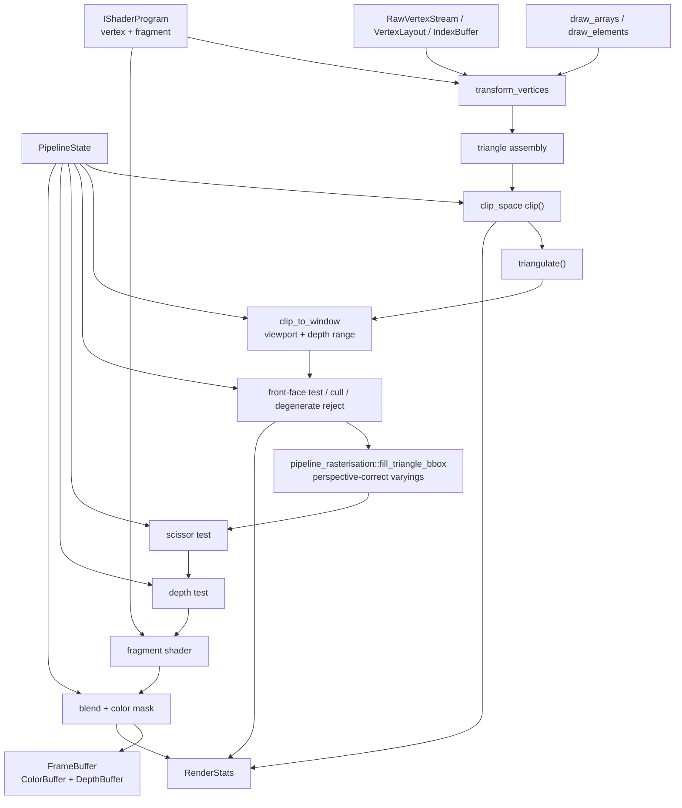

# programmable_pipeline

`//sw_renderer/programmable_pipeline` is the OpenGL-style half of this renderer. It takes the same
shared geometry, clipping, texture, and buffer foundations as the fixed pipeline, but rebuilds the
actual draw path around explicit pipeline state plus user-supplied vertex and fragment programs.

This document explains that pipeline as a tutorial: what building blocks were introduced, why they
exist, and how they fit together into `Pipeline::draw_arrays()` and `Pipeline::draw_elements()`.

## What this pipeline is

The programmable pipeline is centered on three ideas:

1. shaders are objects implementing `IShaderProgram`
2. vertex input is described explicitly with `VertexLayout` and `RawVertexStream`
3. fixed-function GPU state is represented as plain data in `PipelineState`

The key public files are:

- `pipeline.h` / `pipeline.cpp`
- `pipeline_state.h`
- `shader.h`
- `vertex_layout.h`
- `vertex_stream.h`
- `frame_buffer.h`
- `clip_space.h`
- `pipeline_rasterisation.h`

## Mental model

This package reconstructs a small software GPU pipeline in explicit stages.

The easiest way to understand it is as five layers:

1. shader interface
2. vertex input system
3. clip-space and raster math
4. fragment operations and render state
5. utility layers that make writing shaders practical



## How it was built, step by step

### Step 1: define a shader contract

The first thing a programmable renderer needs is a stable API between the renderer and user code.

That contract lives in `shader.h`:

- `VertexContext`
- `FragmentContext`
- `VertexShaderOutput`
- `FragmentShaderOutput`
- `IShaderProgramGeneric<CAPACITY>`
- `IShaderProgram`

The design is intentionally minimal:

- the vertex stage returns clip-space position plus varyings
- the fragment stage receives interpolated varyings and fragment built-ins
- uniforms are just C++ members on the shader object

That keeps the implementation simple while still matching the structure of a real graphics API.

### Step 2: make vertex input explicit

In a programmable pipeline, vertex input cannot be hardcoded to one mesh vertex type. This package
solves that with:

- `VertexAttribute`
- `VertexLayout`
- `AttributeView`
- `RawVertexStream`
- `TypedVertexStream`
- `IndexBuffer`

This is the equivalent of a graphics API's vertex-array description.

Why it matters:

- shaders consume attributes by location, not by C++ struct field name
- the same pipeline can draw many vertex layouts
- tests can exercise decoding independently of the rasterizer

`AttributeView::attribute(location)` is the key convenience layer: it turns raw bytes into a
`Vector4F` that shader code can consume immediately.

### Step 3: add a generic varying substrate

Fixed pipelines can hardcode what gets interpolated. Programmable pipelines cannot. This package
therefore introduces a generic varying storage model in `register_file.h`:

- `RegisterFile<T, N>`

This is the low-level payload carried from the vertex stage to the fragment stage. It is designed to
be:

- fixed-size
- arithmetic-friendly
- interpolatable
- independent of any specific shader

Then `varyings.h` adds `VaryingsBase`, which is a typed overlay for people who want named accessors
without giving up the generic register-file representation.

This is an important design choice: the rasterizer only needs to understand register files, while
shader authors can still build nicer abstractions on top.

### Step 4: move clipping into clip space

Once shaders can emit clip-space positions, the next problem is clipping triangles correctly.

That is what `clip_space.h` adds:

- `ClipVertex<T>`
- homogeneous clip planes (`left`, `right`, `top`, `bottom`, `near`, `far`)
- `signed_distance()`
- `lerp()`
- `clip(v0, v1, v2)`

This builds directly on the generic clipper in `//sw_renderer:core`, but specializes it for the GPU
view of clip space.

That was a major architectural step because it guarantees a useful invariant for the later stages:

- every emitted clipped vertex has a valid `w` for perspective divide

### Step 5: separate rasterization from pipeline orchestration

The next design problem is that the pipeline itself should not be full of pixel-iteration details.
So rasterization is split out into `pipeline_rasterisation.h`.

That file owns the programmable-pipeline-specific triangle walk:

- visit pixels in a bounding box
- compute barycentrics
- compute perspective-correct varyings
- compute affine window-space depth
- emit one callback per covered fragment

Like the fixed pipeline, this bounding-box walk follows Juan Pineda's
"A Parallel Algorithm for Polygon Rasterization": coverage comes from incremental edge functions,
while the programmable path layers perspective-correct varying interpolation on top.

This mirrors how `fixed_pipeline/rasterisation_routines.h` works, but here the per-pixel payload is a
`RegisterFile` instead of a fixed `Vertex` shape.

This split is what makes `Pipeline` readable: orchestration in one place, raster math in another.

### Step 6: add explicit framebuffer and state objects

A programmable pipeline becomes much easier to reason about once mutable state is grouped into clear
objects instead of hidden inside one renderer class.

This package introduces:

- `FrameBuffer` in `frame_buffer.h`
- `PipelineState` in `pipeline_state.h`

`FrameBuffer` owns the render targets:

- `ColorBuffer`
- `DepthBuffer`

`PipelineState` owns the fixed-function GPU state that still exists even in a programmable API:

- viewport
- depth range
- cull mode
- front-face rule
- depth test / depth write
- blend state
- scissor
- color mask

This was the point where the renderer stopped being "a programmable triangle filler" and became "a
programmable graphics pipeline".

### Step 7: build the actual pipeline driver

With the pieces above in place, `pipeline.cpp` becomes the stage coordinator.

The flow today is:

1. `transform_vertices()` runs the vertex shader once per vertex.
2. `draw_arrays()` or `draw_elements()` assembles triangle primitives.
3. `process_triangle()` clips the primitive in clip space.
4. clipped polygons are triangulated.
5. each triangle is transformed into window space.
6. culling and degenerate rejection happen.
7. `fill_triangle_bbox()` from `pipeline_rasterisation.h` emits fragments.
8. each fragment runs scissor, depth test, fragment shader, optional depth override, blend, and
   color write.

That is the heart of the package.

## The actual draw path

This is the practical shape of `Pipeline::draw_*` today:

```text
vertex stream + optional index buffer
  -> vertex shader
  -> triangle assembly
  -> clip-space clipping
  -> polygon triangulation
  -> perspective divide / viewport transform
  -> cull and degenerate reject
  -> rasterize covered pixels
  -> scissor test
  -> depth test
  -> fragment shader
  -> optional fragment depth override
  -> depth write
  -> blend + color mask write
```

That order is worth studying because it is where most of the package's design decisions show up.

## Two draw overloads: virtual and templated

`Pipeline::draw_arrays` / `draw_elements` each come in two overloads that share one rasterizer body:

- the **virtual** overload takes `const IShaderProgram&` - the canonical interface, used by the
  dynamic/scripted path and anywhere the shader type is not known at compile time;
- the **templated** overload takes a concrete `const ShaderT&` - it keeps the concrete shader type, which
  is what lets a C++ shader build typed, named vertex/varying accessors on top instead of working only
  through attribute indices.

Overload resolution picks automatically: pass a concrete shader and you get the templated overload; pass
something whose static type is `IShaderProgram` and you get the virtual one. Both forward to the same
internal `draw_*_impl<ShaderT>` (the virtual path is just the `IShaderProgram` instantiation of it), so they
produce identical output and run at the same speed - the templated overload is a type-safety/ergonomics
convenience, not a separate or faster pipeline.

## Why `PipelineState` was made an aggregate

`PipelineState` is deliberately a plain data struct. That keeps the API easy to construct in tests,
easy to inspect in debugging, and easy to extend without inventing a state-machine wrapper.

This also makes the code feel closer to a software implementation of GPU state blocks than to a game
engine object model.

## Why the rasterizer uses `double_precision`

The programmable path interpolates more than just depth. It also has to handle:

- perspective-correct varyings
- interpolated `1 / w`
- large screen-space triangles in fixed-point mode

That is why `pipeline_rasterisation.h` widens internal math to `double_precision` before narrowing at
the callback boundary.

Without that widening, large fixed-point triangles would overflow in exactly the places a GPU-like
pipeline is most sensitive:

- triangle area
- barycentric accumulation
- weighted varying sums

The fixed-point programmable rasterization tests are specifically guarding those cases.

## How shader authoring was made practical

Once the pipeline existed, it still needed to be usable. That is where the rest of the package comes
in.

### `shader_builtins.h`

This file provides GLSL-style helper functions such as:

- `texture`
- `mix`
- `saturate`
- `step`
- `smoothstep`
- `fract`
- `reflect`
- `refract`

These are not required for the pipeline to work, but they make custom shader code pleasant to write.

### `sampler.h`

Programmable texturing is split out into `Sampler2D`, with explicit:

- wrap mode
- filter mode

That keeps texturing policy out of `Texture` and out of the rasterizer itself.

### `builtin_shaders.h`

This file is the tutorial-by-example layer of the package. It includes several ready-made shaders:

- `FlatColorShader`
- `VertexColorShader`
- `TexturedShader`
- `LitShader`

These show how the system is meant to be used:

- read attributes by location
- write clip-space position
- populate varying slots
- read interpolated varyings in the fragment stage

## If you want to learn this pipeline from code

A good reading order is:

1. `shader.h`
2. `vertex_layout.h`
3. `vertex_stream.h`
4. `pipeline_state.h`
5. `clip_space.h`
6. `pipeline_rasterisation.h`
7. `pipeline.h`
8. `pipeline.cpp`
9. `builtin_shaders.h`
10. `sampler.h`

That path starts with the user-facing API, then gradually descends into the implementation.

## A minimal mental example

To use this pipeline, you need four things:

1. a shader object
2. a vertex stream
3. a framebuffer
4. a pipeline state

Then you call one of:

- `Pipeline::draw_arrays()`
- `Pipeline::draw_elements()`

That API shape is intentional. It mirrors real rendering APIs while still staying small enough to
follow in one source file.

## When to use this pipeline

Use the programmable pipeline when you want:

- custom vertex and fragment behavior
- a clearer separation between pipeline state and draw logic
- a renderer shaped like a small software GPU
- a better foundation for future experimentation (scripting, alternate shaders, new built-ins)

Use the fixed pipeline when you want the most direct mesh-to-pixels reference implementation.
